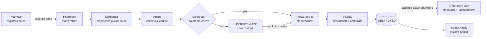

# DOT — Pharmaceutical Trust Registry

**A closed-loop compliance & fraud-detection platform for India's pharmaceutical reverse supply chain.**

DOT tracks expired medicine from pharmacy shelf → distributor → manufacturer →
licensed destruction, recording every step in a tamper-evident, hash-chained
event log that a regulator can audit and any patient can query — with zero
login, in one scan.

[](https://github.com/Suganth-21/dot/actions/workflows/ci.yml)


---

## The problem

When medicine expires on a pharmacy shelf in India, there is no enforced path
for what happens next. It's supposed to flow back up the chain — pharmacy →
distributor → manufacturer → licensed destruction — but nothing verifies that
it actually did.

That gap is where the fraud lives: expired stock gets bought cheaply,
relabelled with a fresh batch number, and resold. This isn't limited to cheap
drugs — oncology drugs and injectable antibiotics are among the products that
reappear. A patient holding relabelled expired Doxorubicin has no way to know.

In May 2025, India's CDSCO mandated a formal reverse-logistics pathway for
expired drugs. The mandate exists. The software to operationalize it did not
— **DOT is that software.**

## What makes it more than CRUD

Five mechanisms carry the actual product value. Every other feature exists to
make these five possible, and none of them are stubbed, feature-flagged, or
cut from the demo:

| Mechanism | What it stops |
|---|---|
| **Re-entry detection** | A batch marked `DESTROYED` that gets scanned or registered again — anywhere — fires a critical alert to the regulator and manufacturer within seconds and refuses the transaction. Direct counter to relabel-and-resell fraud. |
| **Quantity-cap check** | Fraudsters who print *new* fake batch numbers instead of reusing destroyed ones evade re-entry detection alone. DOT also tracks units-ever-manufactured per batch and flags circulation exceeding that cap. |
| **The dispute gate** | If the distributor's received count doesn't match the pharmacy's claimed count, the chain halts — no forwarding, no scheduling, no certificate — until a human files resolution notes. A mismatch is treated as a fraud signal, not a rounding error. |
| **Certificate binding** | A destruction certificate cannot be issued for a batch that hasn't cleared distributor confirmation. Prevents "paper destruction" of stock that never actually left circulation. |
| **Tamper-evident event log** | Every event (registration, sale, return, pickup, confirmation, forwarding, destruction) is SHA-256 hash-chained to the previous event and Ed25519-signed by its actor. Rewriting history means reforging every subsequent link *and* forging other actors' signatures. No blockchain — a signed hash chain in a normal database is enough, and is a better fit for this problem (see design notes below). |

**Patient Shield** (`/verify`) is the public face of all of it — scan a box,
get one of three answers: genuine, not found, or a red **DO NOT USE THIS
MEDICINE**. No login, no app install, no data collection. It's the one part
of the system a patient actually touches, which is why the rest has to be
provably trustworthy.

## The six interfaces

| Route | Role | What they do |
|---|---|---|
| `/pharmacy` | **RETAILER** | Registers stock, records sales, initiates returns on expiring batches |
| `/distributor` | **DISTRIBUTOR** | Receives return requests, plans pickup routes, verifies received quantities, forwards to manufacturer |
| `/agent` | **PICKUP_AGENT** | Mobile-first. Drives the route, marks arrival, counts and collects at each stop |
| `/manufacturer` | **MANUFACTURER** | Schedules licensed destruction facilities, uploads destruction certificates |
| `/regulator` | **REGULATOR** | CDSCO officer view. Live alerts, full batch/entity audit trail, compliance scoring, report export |
| `/verify` | *public — no login* | Scans a medicine's QR code, gets a plain-language verdict |

All five authenticated roles have a **one-click demo login** on `/login` —
real users, real Argon2 password hashes, real JWT tokens issued through the
actual auth code path. Nothing about the demo bypasses auth.

## How the flow works, end to end



Live GPS-simulated vehicles are visible on every relevant role's fleet map
the instant a route is dispatched — a distributor, manufacturer, and regulator
watching the same pickup in real time over WebSockets.

## Tech stack

| Layer | Choice |
|---|---|
| Frontend | React 18, React Router 6, TanStack Query, Zustand, Tailwind CSS (custom claymorphic design system), Recharts, react-leaflet + OpenStreetMap, html5-qrcode, Framer Motion, Sonner |
| Backend | Python 3.11+, FastAPI, uvicorn — all routes under `/api` |
| Database | PostgreSQL 16, SQLAlchemy 2.0 (async), Alembic migrations |
| Auth | JWT access + refresh tokens, Argon2 password hashing |
| Real-time | FastAPI WebSockets fanned out via Redis pub/sub |
| Integrity | SHA-256 canonical-JSON hash chain + Ed25519 actor signatures — **no blockchain** |
| Rate limiting | `slowapi`, tighter limits on public `/verify` routes |
| Testing / CI | pytest + pytest-asyncio + httpx, GitHub Actions on every backend change |

Clean architecture throughout the backend: routers only handle HTTP, all
domain rules live in the service layer inside a transaction, repositories are
the only thing that touches the database. The frontend's `src/services/*.js`
functions are the API contract — the backend conforms to their shape, not the
other way round, so the UI never had to change to accommodate the backend.

## Getting started

### Backend

```bash
cd backend
python -m venv .venv && source .venv/bin/activate   # .venv\Scripts\activate on Windows
pip install -r requirements.txt

cp .env.example .env   # fill in JWT_SECRET / SIGNING_MASTER_KEY (see comments in the file)
# requires a running PostgreSQL + Redis reachable at the URLs in .env

python -m alembic upgrade head
uvicorn app.main:app --reload
```

API docs: `http://localhost:8000/api/docs` (auto-generated OpenAPI).

### Frontend

```bash
cd frontend
yarn install
yarn start        # http://localhost:3000
```

### Or both at once, via Docker

```bash
cp backend/.env.example backend/.env   # fill in real secrets first
docker compose up
```

Spins up Postgres + Redis + the API together (`docker-compose.yml`) —
provided for anyone deploying beyond a laptop; local `uvicorn`/`yarn start`
remains the documented fast path for day-to-day development.

## The demo path

This is the acceptance test for the whole system — it must work end to end,
using nothing but the five one-click logins:

1. **Pharmacy Portal** → `Inventory → Add Stock` → scan **`BATCH-DOX-2026-A17`** (Doxorubicin, pre-seeded `EXPIRING_SOON`) → register 50 units.
2. Open the batch → **Start Return** → photograph → confirm 50 → select **Sunrise Pharma Distributors**.
3. **Distributor Portal** → the return appears in **Inbox** as `NEW`.
4. Select it → **New route** → assign agent + vehicle → **Dispatch**. The vehicle starts moving on the live map.
5. **Pickup Agent App** → **Start Route** → open the stop → **I have arrived** → enter **45** → **Pickup complete**.
6. Back in **Distributor** → the **dispute gate fires** (45 ≠ 50, chain halted) → fill resolution notes → **Forward to manufacturer**.
7. **Manufacturer Portal** → **Facilities → Schedule** → **Certificates → Upload** (blocked until distributor-confirmed) → submit → batch flips to `DESTROYED`.
8. Any pharmacy → `Add Stock` → scan **`BATCH-DOX-2026-B04`** (pre-destroyed) → **re-entry alert fires on the Regulator dashboard within ~2s**.
9. Open **`/verify`** (public, no login) → scan **`BATCH-DOX-2026-B04`** → 🔴 **DO NOT USE THIS MEDICINE**.

| Demo batch code | What it demonstrates |
|---|---|
| `BATCH-DOX-2026-A17` | Genuine, active, `EXPIRING_SOON` — the return-flow starting point |
| `BATCH-DOX-2026-B04` | Already destroyed — re-entry alert + Patient Shield red verdict |
| `BATCH-FAKE-9999-Z01` | Not found / counterfeit |

The regulator's national fleet map is pre-seeded with 5 simultaneously active
pickup routes across Chennai, Coimbatore, and Madurai, so the map reads as a
live state-wide operation from the moment you log in — not just the one
route you dispatch yourself.

**Reset demo data** in any role's profile menu re-seeds everything
deterministically, through the same code path a fresh install uses.

## Security & integrity notes for reviewers

- Every domain rule above is enforced **server-side, in the service layer,
  inside the transaction that performs the write** — never trusted from the
  frontend, never skippable via query parameter or role.
- `/verify` and every endpoint it calls carry no auth dependency, ever, by
  design — see the rate-limit config instead for how it stays abuse-resistant.
- The event log is append-only: no `UPDATE`, no `DELETE`, in any code path.
- `GET /api/batches/{id}/verify-chain` walks a batch's full history and
  genuinely detects tampering — a modified hash, payload, or signature, or a
  removed event — live, not as a canned demo response.
- Passwords are Argon2-hashed; JWT secrets and the Ed25519 signing master key
  are environment-only, never committed (`backend/.env` is gitignored).

## Testing

```bash
cd backend
pytest
```

Domain-rule tests — proving a rule *cannot* be bypassed, not just that the
happy path works — are treated as first-class deliverables, not an
afterthought. CI runs the full suite against a real PostgreSQL service
container on every backend change.

## Project structure

```
dot/
├── backend/          # FastAPI + SQLAlchemy (async) + Alembic
│   ├── app/
│   │   ├── api/          # HTTP layer only
│   │   ├── services/     # domain logic, rule enforcement, transactions
│   │   ├── repositories/ # the only layer that touches the database
│   │   ├── models/        # SQLAlchemy models
│   │   ├── core/          # auth, crypto, realtime hub, rate limiting
│   │   └── seed/           # deterministic demo data + reset
│   ├── alembic/            # reviewable migration history
│   └── tests/
├── frontend/          # React 18 + Tailwind, service-layer contract in src/services/
├── docker-compose.yml # postgres + redis + api, for deployment beyond localhost
└── .github/workflows/ # CI
```

## Contributors

[Shyam Kumar J](https://github.com/ShyamKumar29) · [Suganth-21](https://github.com/Suganth-21) · [Yaswanth K B](https://github.com/yaswanthme007)
